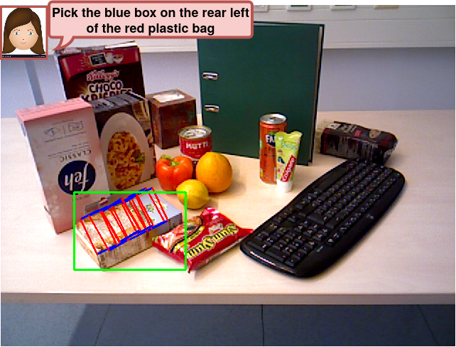

# Language-guided Robot Grasping: CLIP-based Referring Grasp Synthesis in Clutter (CoRL2023)

Created by Georgios Tziafas, Yucheng XU, Arushi Goel, Mohammadreza Kasaei, Zhibin Li, Hamidreza Kasaei

This is an official PyTorch implementation of the baseline end-to-end model [CROG](https://arxiv.org/abs/2311.05779) of our work. The implementation of our CROG model is based on the [CRIS](https://github.com/DerrickWang005/CRIS.pytorch) model, thanks for their amazing work! :beers:

Robots operating in human-centric environments require the integration of visual grounding and grasping capabilities to effectively manipulate objects based on user instructions. This work focuses on the task of referring grasp synthesis, which predicts a grasp pose for an object referred through natural language in cluttered scenes. Existing approaches often employ multi-stage pipelines that first segment the referred object and then propose a suitable grasp, and are evaluated in private datasets or simulators that do not capture the complexity of natural indoor scenes. To address these limitations, we develop a challenging benchmark based on cluttered indoor scenes from OCID dataset, for which we generate referring expressions and connect them with 4-DoF grasp poses. Further, we propose a novel end-to-end model (CROG) that leverages the visual grounding capabilities of CLIP to learn grasp synthesis directly from image-text pairs. Our results show that vanilla integration of CLIP with pretrained models transfers poorly in our challenging benchmark, while CROG achieves significant improvements both in terms of grounding and grasping. Extensive robot experiments in both simulation and hardware demonstrate the effectiveness of our approach in challenging interactive object grasping scenarios that include clutter.


**Check our demo video [here](https://www.youtube.com/watch?v=D3auLBUX-EM&t=5s)**

## Example
<p align="center">
  
</p>


## News
- :sunny: [Aug 30, 2023] Our paper was accepted by CoRL-2023.


## Preparation

1. Environment
   - use the environment.yml file to create the conda env.
2. Datasets
   - The detailed instruction is in [OCID-VLG](https://github.com/gtziafas/OCID-VLG) repo.

## Quick Start

This implementation only supports **multi-gpu**, **DistributedDataParallel** training, which is faster and simpler; single-gpu or DataParallel training is not supported. Besides, the evaluation only supports single-gpu mode. In our case, we train the CROG on 2 RTX-4090 GPUs. The training procedure takes around 3.5 hours. To do training of CROG with 2 GPUs, run:

```
python -u train_crog.py --config config/OCID-VLG/CROG_multiple_r50.yaml
```

To do training of SSG with 2 GPUs, run:
```
python -u train_ssg.py --config config/OCID-Grasp/ssg_r50.yaml
```

**Please remember to modify the path to the dataset in config files.**


## License

This project is under the MIT license. See [LICENSE](LICENSE) for details.

## Citation
If you find our work useful in your research, please consider citing:
```
@inproceedings{tziafas2023language,
  title={Language-guided Robot Grasping: CLIP-based Referring Grasp Synthesis in Clutter},
  author={Tziafas, Georgios and Yucheng, XU and Goel, Arushi and Kasaei, Mohammadreza and Li, Zhibin and Kasaei, Hamidreza},
  booktitle={7th Annual Conference on Robot Learning},
  year={2023}
}
```
